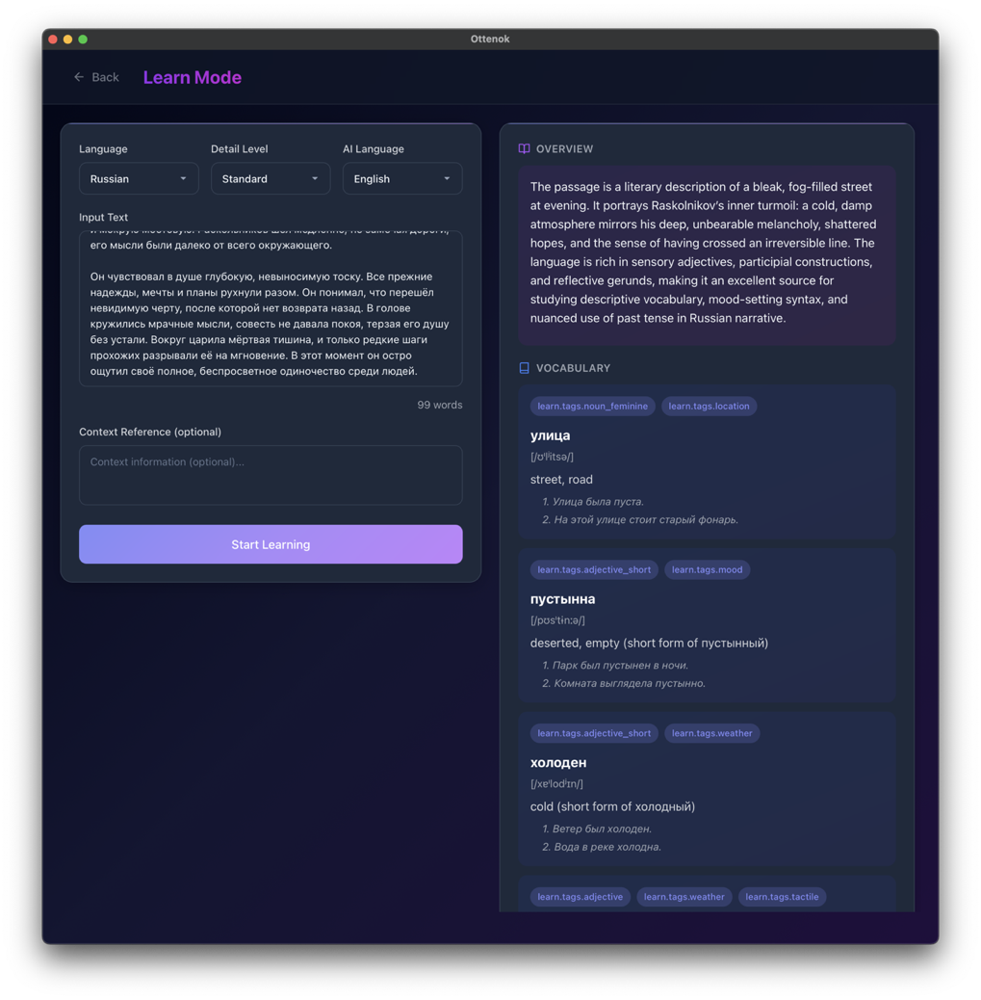
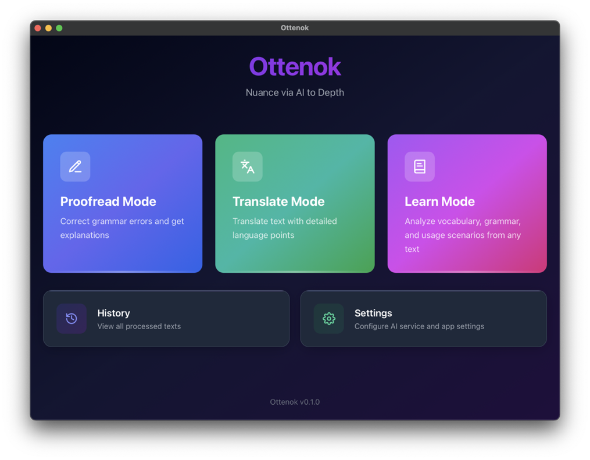
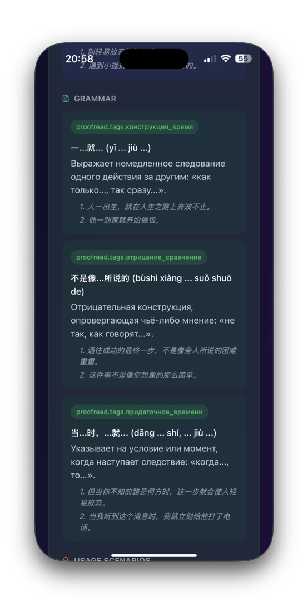
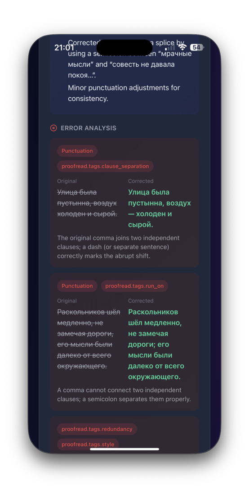
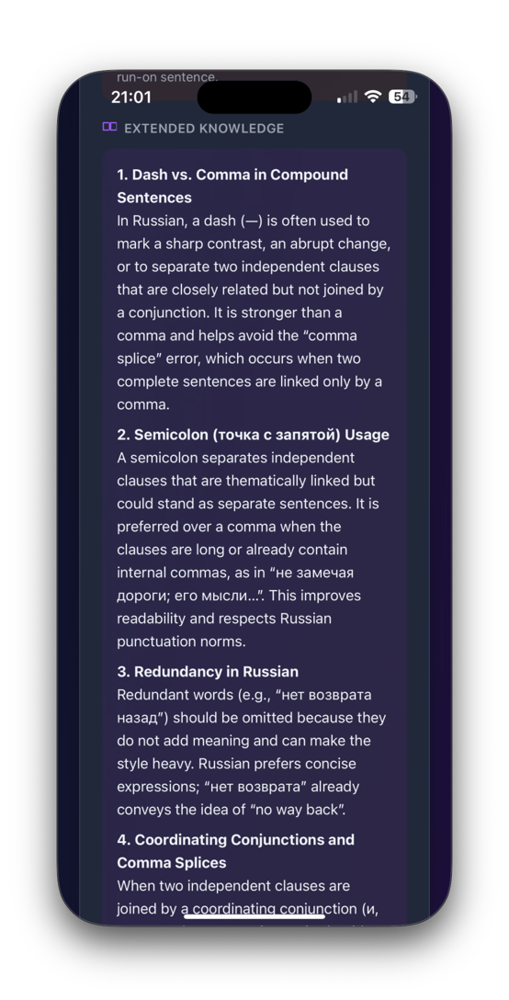
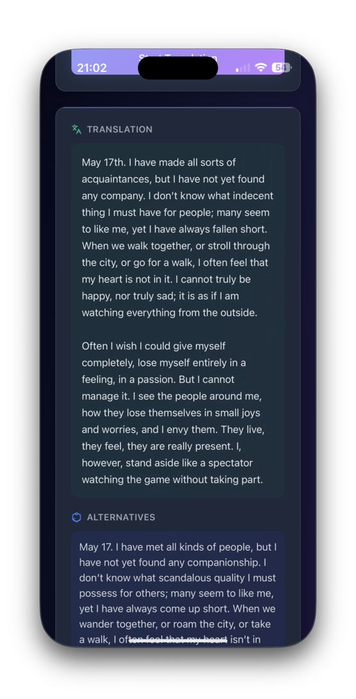
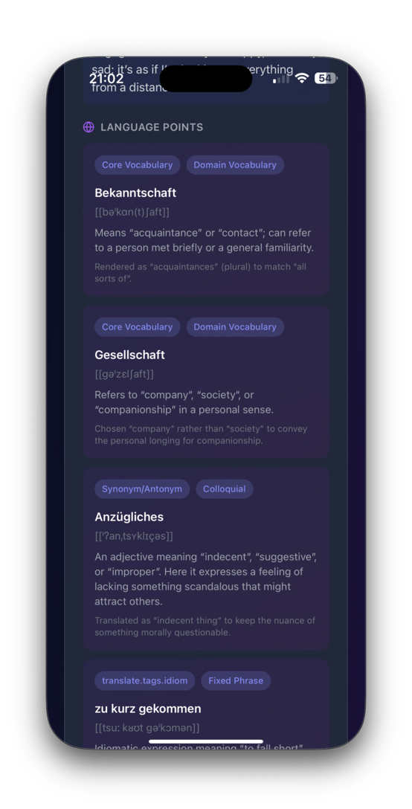
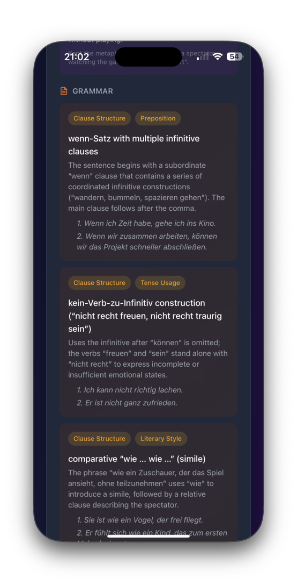

# Ottenok

[Official Website](https://lang.ottenok.com) | [Try Now](https://lang.ottenok.com/download)

Ottenok is an AI-powered language learning tool that helps you proofread, translate, and learn languages with intelligent text checking, for better language study.

## Example Screenshots

### Desktop

  
  

### Mobile

  
  
  

  
  
  

## Support

If Ottenok is helpful to you, your support is appreciated:

- **ifdian (China)**: https://ifdian.net/a/kivanskoi
- **USDT (TRC20)**: THbyoWQFyBDTFqxkbq9b5cw6GKvkMgHg3w

## Features

### Three AI Modes

**Proofread**
- Correct text with grammar and spelling suggestions
- View detailed error analysis with explanations
- Learn vocabulary and grammar points from corrections

**Translate**
- Learn through translation, not just translate
- Understand why a translation is rendered that way
- Get grammar explanations and usage examples

**Learn**
- Interactive language learning from any text
- Grammar analysis and knowledge point explanations
- Usage scenarios for new vocabulary

### Smart Features

- **Detailed Levels**: Choose Minimal, Standard, or Deep analysis
- **AI Response Language**: Get explanations in your preferred language
- **Fixed Tags System**: Errors and vocabulary are categorized using a consistent tag system for better learning

### History & Records

- All your proofreading, translation, and learning records are saved automatically
- Search and browse your history
- Delete individual records or batch cleanup old data
- Export/Import your configuration and data

### AI Service Configuration

- Bring your own API endpoint - Ottenok works with any OpenAI-compatible API
- Support for custom models
- Test your AI configuration before use
- API keys are encrypted and stored locally
- Tested with models from ModelScope, DeepSeek, and LMStudio (Qwen model)
- Example: `https://api.modelscope.cn/v1`

### Multi-Language Interface

- English
- Chinese
- Russian

### Appearance

- Light and Dark theme
- Follows your system preference by default
- Modern minimalist design with glassmorphism effects

## Supported Languages for AI Interaction

- Russian
- English
- German
- French
- Spanish
- Japanese
- Chinese

## Platform Support

- macOS
- Windows
- Linux
- iOS (via Tauri iOS)
- Android (via Tauri Android)

## Data Storage

All your data is stored locally in a DuckDB database:

- **macOS**: `~/Library/Application Support/ottenok/grammar.db`
- **Windows**: `%APPDATA%/ottenok/grammar.db`
- **Linux**: `~/.local/share/ottenok/grammar.db`

## Technology

Built with Tauri and Rust for native performance and security.

## Getting Started

**Note**: Ottenok requires you to configure your own AI service API. Please follow the [API Configuration Guide](https://lang.ottenok.com/guide#getting-api-keys) to set up your AI service.

## License

Copyright © 2026 PaKiva. All rights reserved.

This software is provided for personal use only. Redistribution, resale, modification, or any commercial use is strictly prohibited without prior written consent.

This product includes software developed with Tauri and Rust.